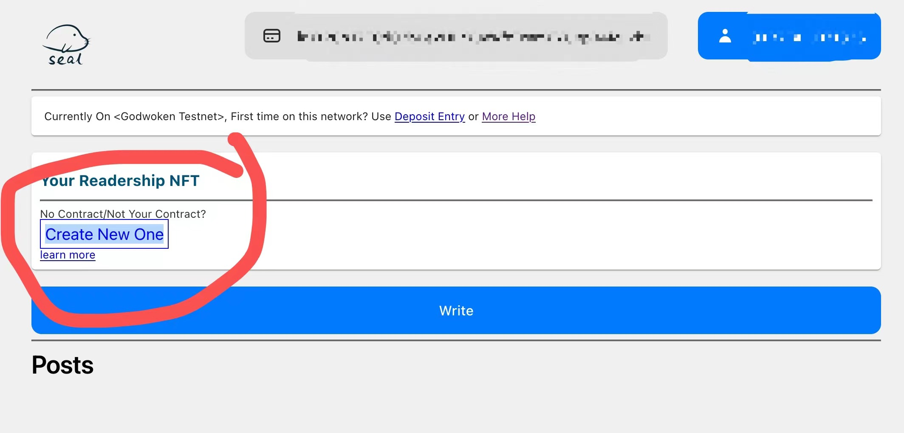
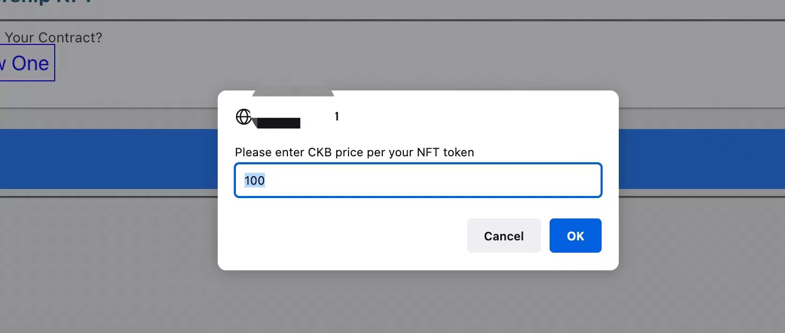
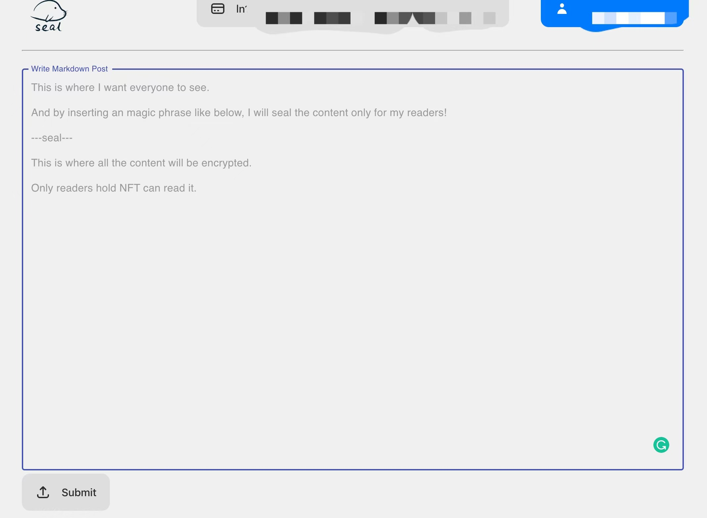
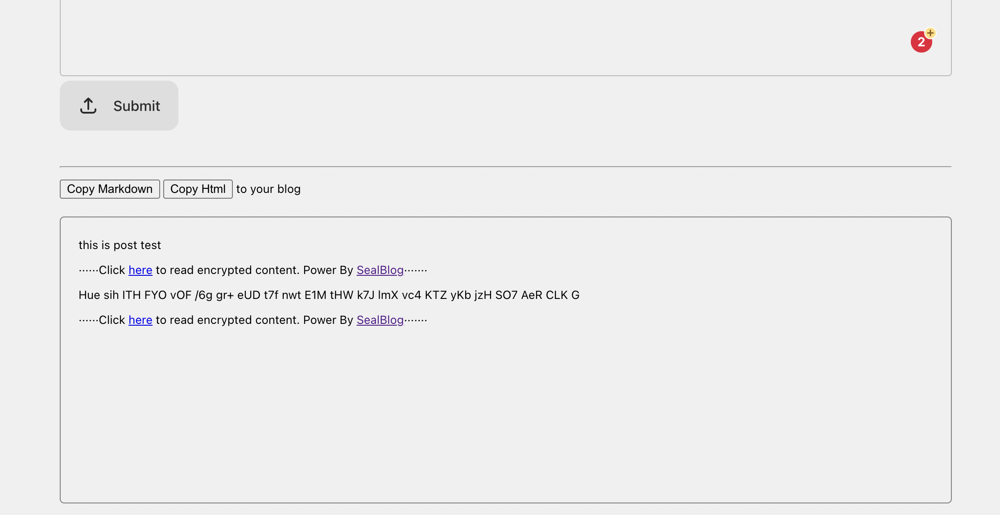
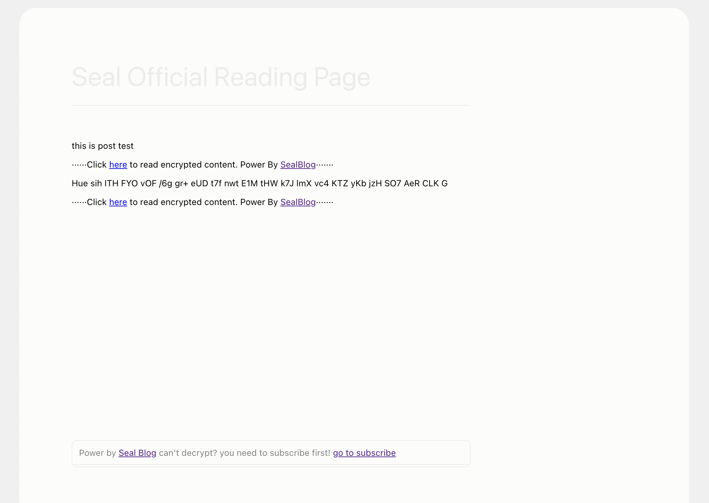
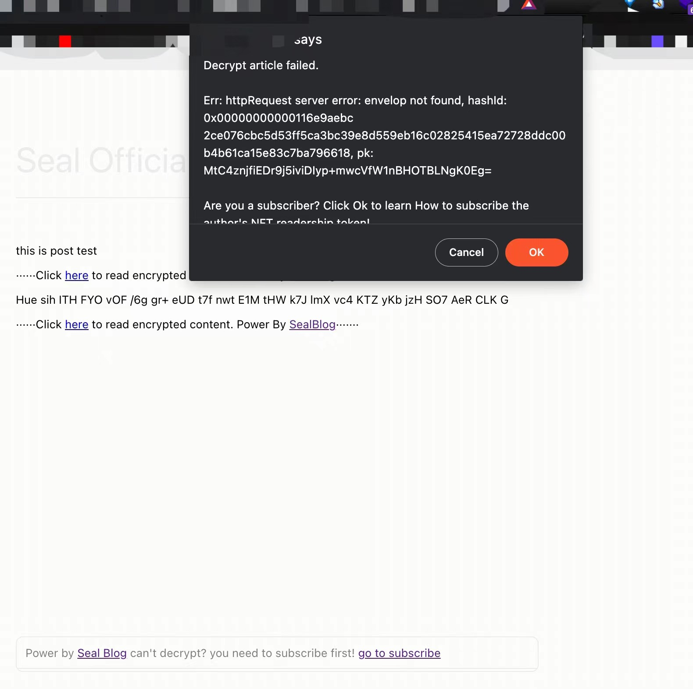
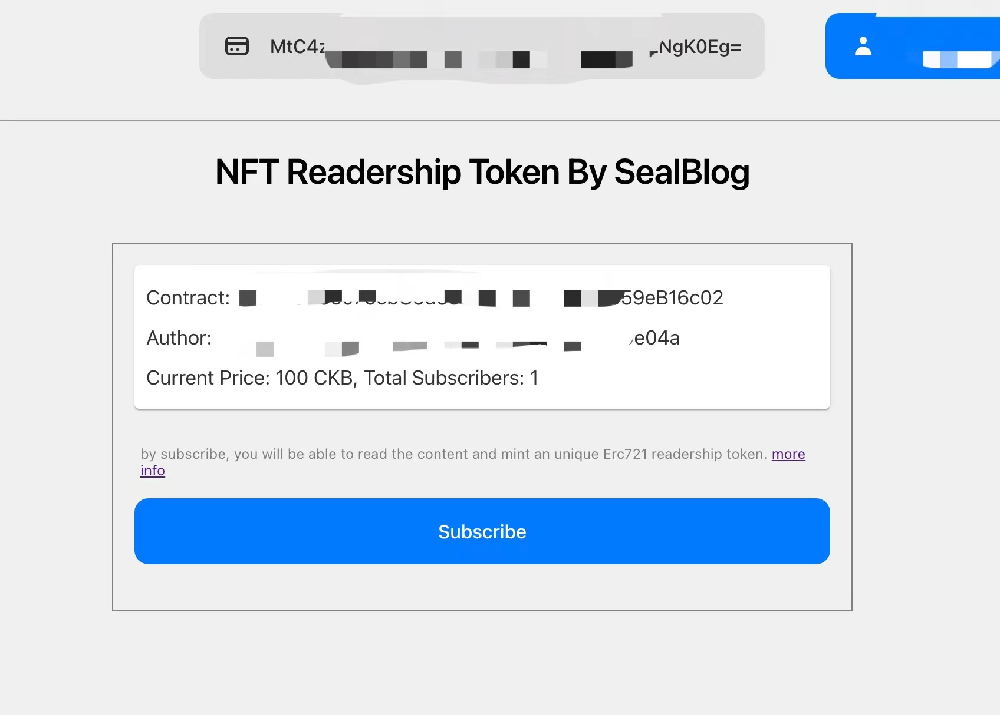
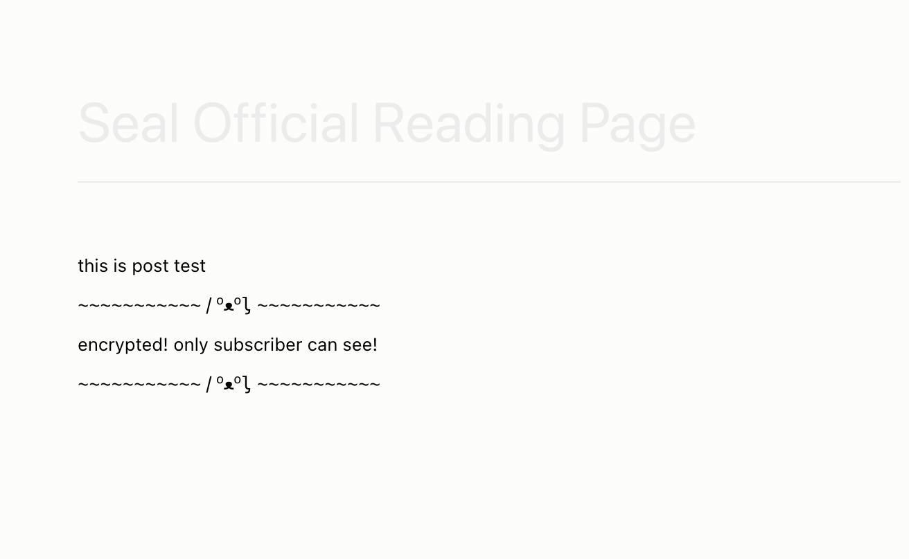

# Seal Onboarding Guide

Pre-Requires:

- Only support Web, unavailable for Mobile
- Install [Metamask extension](https://metamask.io/) and setup Wallet on your browser
- You might need to setup layer2 account according to the blockchain network you selected.

In the following tutorial, we use Godwoken network with CKB token, other layer2 networks goes the same way. 

Before you start, set up Godwoken Layer2 Account by [depositing CKB](https://light-godwoken-git-tx-history-cryptape.vercel.app/#/v1)

## Blogger

1. Insert the script tag on your blog post html page.

```sh
<script src="https://cdn.jsdelivr.net/npm/@seal-blog/sdk@v0.6.0-rc1/bundle/unseal.min.js"></script>
```

If you can't edit the html source code of your blog, just ignore this step. You can still use Seal, the difference it that the decryption process will redirect your readers from your blog to Seal official home page, if you don't mind.

2. Depoly a NFT represent your blog pay wall membership

Go to [Seal user page](https://sealblog.xyz/user), after connect with your Metamask wallet, click `Create New One`.



Enter how many CKBs you want to set for one NFT membership token



Click ok and sign the transaction with Metamask and wait for the transaction to be confirmed. After that, refresh the page.

3. Write the first post

In [Seal user page](https://sealblog.xyz/user), click `Write` button.

In the editor page, write your post(support markdown) in the textarea, insert the magic line `---seal---` into where you want the encrypted premium content begins.



Click `Submit` when your post are ready.

After submitting success, you will find your final form of post down in the page. 



Click `Copy Markdown` or `Copy Html` of the post with your need, and paste it in your blog like a normal post, publish it as usual, and everything is done!

## Readers

Click the word `here` to decrypt the premium content when you are reading post.



If the decryption failed, it means you are not a membership NFT token holder for this blog. 



By clicking `ok` you will be redirect to the subscribe page.



In the subscribe page, you can see how much it cost to subscribe. By subscribing, you are mint a NFT token which cost the exact CKB in `Current Price`.

Click `Subscribe` and sign the transaction with Metamask, after the transaction is confirmed, you are officaily one of the blog membership NFT holder, and you are able to read the premium content now. Just go to the blog post page, refresh and try decrypting again.


